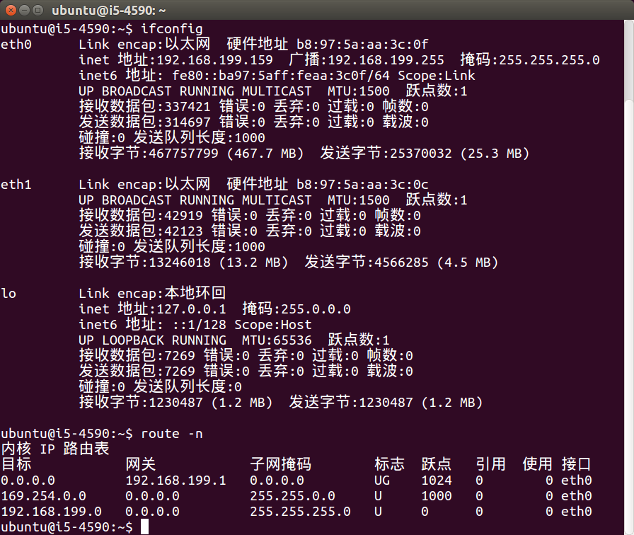
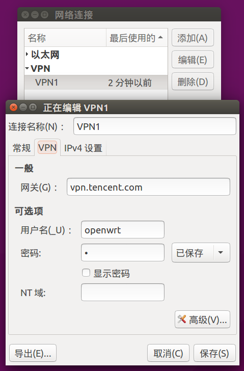
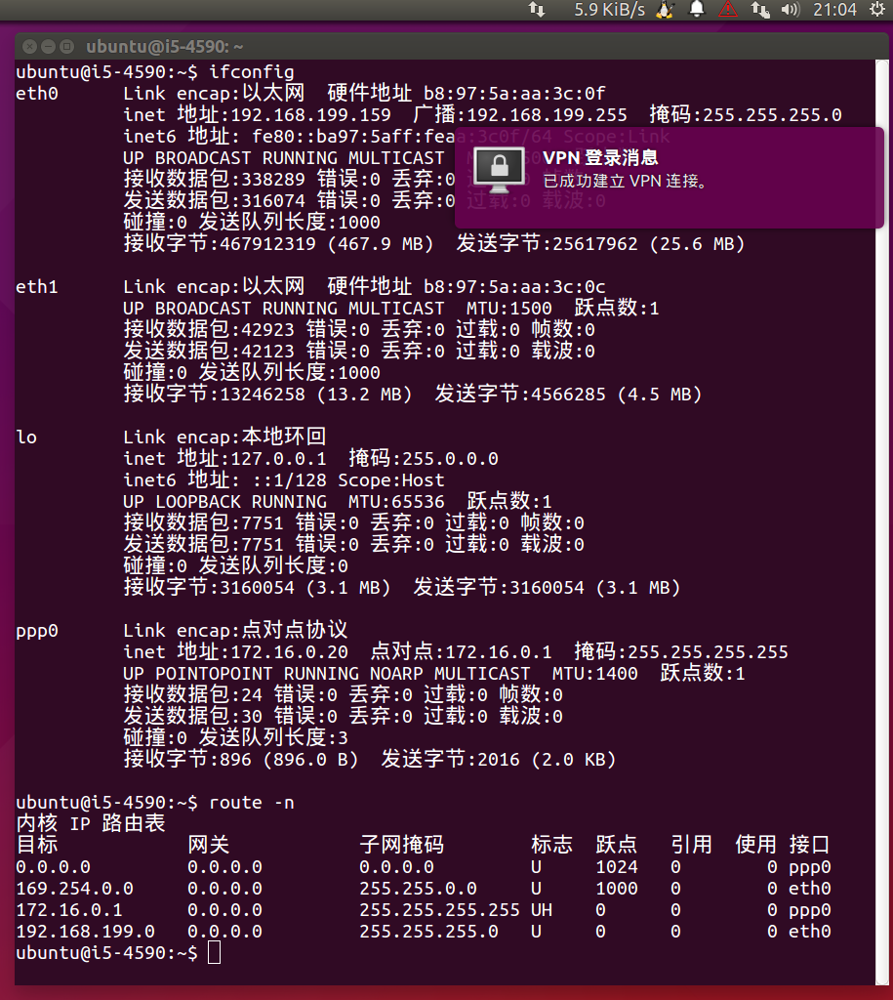
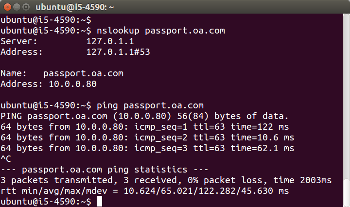
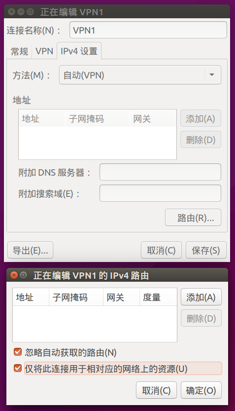
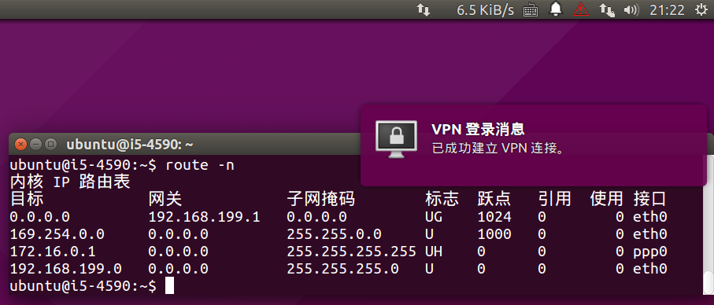
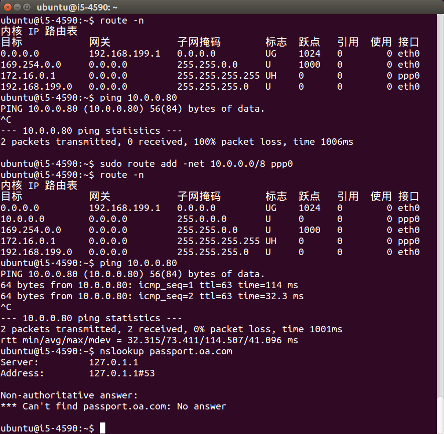
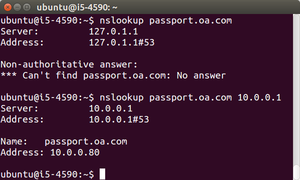
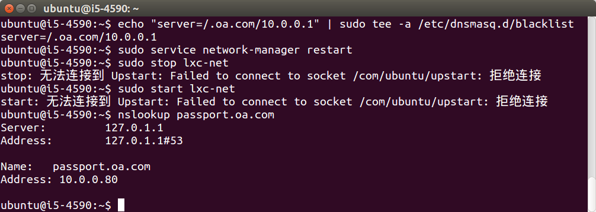

# 智能网络分流 smart VPN

智能VPN的典型场景是：在家或者出差办公时，需要连接公司内网（intranet），又不想把所有流量都通过公司转发，那样上网太慢，所以如果能配置外网黑名单，默认所有请求都走外网（internet），而黑名单的IP和域名不走外网，走VPN，这样分流就互不影响了。

## 常见的公司内网服务

企鹅公司的内网网段为10.0.0.0/8，内部网站有passport.oa.com、isux.oa.com，访问之前需要先连接公司VPN。

喵星人公司的内网网段为10.0.0.0/8，内部DNS为10.13.x.x，内部网站有[crm.alibaba-inc.com](http://crm.alibaba-inc.com/)、[work.alibaba-inc.com](http://work.alibaba-inc.com/)、[aliway.com](http://aliway.com/)，访问之前需要先连接公司VPN（文档：[https://alilang.alibaba-inc.com/portal/help.htm](https://alilang.alibaba-inc.com/portal/help.htm)），连接之后，访问截图如下：


熊掌公司的内网网段为10.0.0.0/8，内部网站有family.baidu.com、erp.baidu.com、icafe.baidu.com，访问之前需要先连接公司VPN（文档：[vpn.baidu.com](https://vpn.baidu.com/)）。

执行下列指令：

```
nslookup passport.oa.com
```


可以看到passport.oa.com无法解析，是个内网域名，要连上企鹅公司内网，使用公司内网DNS解析。

假设家里的网络是192.168.199.0/24，路由器IP是192.168.199.1，DNS是192.168.199.1。以企鹅公司为例，假设公司DNS为10.0.0.1，公司FTP为10.0.0.21，公司内部网站为passport.oa.com。VPN网段为172.16.0.0/12。目标：智能分流，可直接访问公司FTP和oa。先从简单的开始：在电脑上实现分流。

## 电脑设置路由表实现IP智能分流

家里电脑现在可以正常上网，网络状态和路由表如下：



可以看到默认路由是 0.0.0.0 192.168.199.1 eth0，即所有网络请求都通过eth0网卡发往192.168.199.1网关。

现在连接公司VPN，如下图：





可以看到建立VPN连接后，多了一个ppp0，IP为172.16.0.20，默认路由变成了ppp0，即所有网络请求都通过ppp0即VPN通道进行发送。内网域名也可以解析并访问了。

如何默认走外网，而不是VPN呢？忽略路由表，断开重连即可，如图：




这时再试试解析内网域名，显然不通了，即使我们知道网站的IP，也无法访问，如图：

```
nslookup passport.oa.com
ping 10.0.0.80
```


试试下面的指令：

```
ping 172.16.0.1
```


可以发现此时电脑和VPN网关是通畅的，也就是192.168.199.0/24能访问到172.16.0.0/12，但无法访问10.0.0.0/8。添加一条路由表即可：

```
sudo route add -net 10.0.0.0/8 ppp0
```



可以看到IP能访问了，但公司内网域名还是无法解析，如果获得公司所有内网域名的IP，写到电脑hosts文件里，也算勉强能用了。缺点是一旦IP变化，就麻烦了，所有人都要改。所以最好能做到域名智能分流，请看下面的内容。

## 电脑设置dnsmasq实现域名智能分流

尝试解析公司内网域名，不指定DNS 和 指定公司DNS进行对比，如下图：



可以发现只要告诉电脑，凡是公司的域名都走公司DNS解析即可。在Ubuntu电脑上，系统自带的dnsmasq即可实现，指令如下：

```
echo "server=/.oa.com/10.0.0.1" | sudo tee -a /etc/dnsmasq.d/blacklist
```

不过Ubuntu重启dnsmasq比较麻烦，如下：

```
sudo service network-manager restart
sudo stop lxc-net
sudo start lxc-net
```



Linux电脑VPN智能分流到此完成。使用了sudo命令，也就是管理员权限。正常的Android和iOS设备没有root，没法使用此命令，而且如果是分公司办公，人人都要这样设置，维护成本会很高。有没有更好的方案？有，那就是——智能VPN路由器。

## 打造智能VPN路由器

OpenWrt路由器也是Linux，操作步骤和上面几乎一样，大家自行试验。如果做出来了，说明理解了路由表和iptables。如果有问题的话，请google找到教程，系统的学习Linux和iptables。

## 参考资料

 * 《通过某APP进入阿里内网》 [http://www.wooyun.org/bugs/wooyun-2010-063730](http://www.wooyun.org/bugs/wooyun-2010-063730)
 * 《我是如何进入阿里内网寻找马云大叔的》 [http://www.wooyun.org/bugs/wooyun-2014-054113](http://www.wooyun.org/bugs/wooyun-2014-054113)
 * 《一次成功的漫游腾讯内部网络过程》[http://www.wooyun.org/bugs/wooyun-2010-054271](http://www.wooyun.org/bugs/wooyun-2010-054271)
 * 《从一个phpinfo到一次半途而废的腾讯内网漫游之旅》[http://www.wooyun.org/bugs/wooyun-2010-0121069](http://www.wooyun.org/bugs/wooyun-2010-0121069)
 * 《百度某系统存在注入可导致内网被渗透》 [http://www.wooyun.org/bugs/wooyun-2010-019150](http://www.wooyun.org/bugs/wooyun-2010-019150)
 * 《一次失败的漫游百度内部网络过程》 [http://www.wooyun.org/bugs/wooyun-2010-050906](http://www.wooyun.org/bugs/wooyun-2010-050906)

<div id="comments" data-thread-key="docs-smart-vpn"></div>
